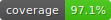

# BOT Detection Service

This is a BOT detection and classification platform. At this stage it is very simple, but supports extensions to make it more an more robust.

## Getting started

Open this project in your Kotlin preferred IDE and you can just press `Run` to start the project.  
You can then open your browser on the `http://localhost:8080/v1/swagger/` to read the APIs documentation.